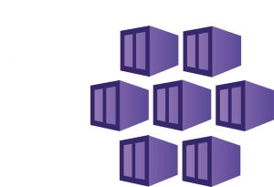

# AKS Cookbook 🧪 Labs on Cloud Native + AI

Combining **Cloud-Native** technologies, particularly **Kubernetes**, with the latest advances in **AI**, including generative AI, provides substantial benefits in building intelligent applications. Kubernetes offers a robust orchestration platform that ensures scalable, reliable, and efficient resource management, critical for handling the extensive computational demands of AI workloads.

[Azure Kubernetes Service (AKS)](https://learn.microsoft.com/en-us/azure/aks/what-is-aks) is a robust and fully managed container orchestration service provided by Microsoft Azure, designed to simplify the deployment, management, and scaling of containerized applications using Kubernetes. AKS enhances the development of intelligent applications by integrating features like seamless integration with Azure AI services such as Azure OpenAI, automated scaling, seamless updates, and an AI toolchain operator (KAITO) to host your own models. These capabilities ensure reliable and efficient application performance, operational agility, and reduced complexity in managing containerized environments. Additionally, AKS provides superior security through Microsoft Entra integration and network policies, making it a pivotal choice for developers striving to build intelligent applications.
> [!NOTE]
> AKS is playing a pivotal role in powering OpenAI and ChatGPT, enabling them to serve millions of users globally with high efficiency and scalability. 

## 🧪 Labs

Acknowledging the rising dominance of Python, particularly in the realm of AI, along with the powerful experimental capabilities of Jupyter notebooks, the following labs are structured around Jupyter notebooks, with step-by-step instructions with Python scripts, infrastructure as code ([Bicep](https://learn.microsoft.com/en-us/azure/azure-resource-manager/bicep/overview?tabs=bicep), [Terraform](https://www.terraform.io/)), and command line tools ([Azure CLI](https://learn.microsoft.com/en-us/cli/azure/), [kubectl](https://kubernetes.io/docs/reference/kubectl/), [helm](https://helm.sh/), ...)

### 🚀 Quickstarts

To get started quickly, use the following labs which provision a standard AKS cluster with a vanilla configuration. These labs use either the [Azure CLI](https://learn.microsoft.com/en-us/cli/azure/) command line tool or a declarative language, with options provided in both [Bicep](https://learn.microsoft.com/en-us/azure/azure-resource-manager/bicep/overview?tabs=bicep) and [Terraform](https://www.terraform.io/) flavors.

| [Quickstart with CLI](labs/aks-quickstart-cli/aks-quickstart-cli.ipynb)  | [Quickstart with Bicep](labs/aks-quickstart-bicep/aks-quickstart-bicep.ipynb) | [Quickstart with Terraform](labs/aks-quickstart-tf/aks-quickstart-tf.ipynb) |
| -------- | -------- |-------- |
|  |  |  |

### [🧪 AKS Automatic](labs/aks-automatic/aks-automatic.ipynb)

|   |  |
| -------- | -------- |
|  | This lab provides a step-by-step guide to setting up and managing an AKS Automatic cluster using BICEP. AKS Automatic offers an experience that makes the most common tasks on Kubernetes fast and frictionless, while preserving the flexibility, extensibility, and consistency of Kubernetes. |

### [🧪 AKS with Azure OpenAI](labs/aks-openai/aks-openai.ipynb)

|   |  |
| -------- | -------- |
|  | Use this lab to quickly Deploy an application that uses OpenAI on Azure Kubernetes Service (AKS). It's based on the official [AKS documentation](https://learn.microsoft.com/en-us/azure/aks/open-ai-quickstart?tabs=aoai). |

### [🧪 Kubernetes AI Toolchain Operator (KAITO)](labs/aks-kaito/aks-kaito.ipynb)

|   |  |
| -------- | -------- |
|  | In this lab we explore the workflow of onboarding large AI inference models in Kubernetes with Kaito.  It's based on the official [AKS documentation](https://learn.microsoft.com/en-us/azure/aks/ai-toolchain-operator).  |

### [🧪 Zero to JupyterHub with AKS](labs/aks-jupyterhub/aks-jupyterhub.ipynb)

|   |  |
| -------- | -------- |
|  | This lab follows the official [Jupyter documentation](https://z2jh.jupyter.org/en/stable/) to deploy Jupyterhub on AKS. |

### [🧪 Kubeflow on AKS](labs/aks-kubeflow/aks-kubeflow.ipynb)

|   |  |
| -------- | -------- |
|  | In this lab you will deploy an AKS cluster and other Azure services to create a Jupyter notebook server.  |

### [🧪 Promptflow on AKS](labs/aks-promptflow/aks-promptflow.ipynb)

|   |  |
| -------- | -------- |
|  | Playground to try the [Azure AI Studio Prompt Flow](https://learn.microsoft.com/en-us/azure/ai-studio/how-to/prompt-flow) with AKS. Prompt flow is a development tool designed to streamline the entire development cycle of AI applications powered by Large Language Models (LLMs). |

### [🧪 AI-Driven Security Threat Detection and Response in AKS](labs/aks-falco/aks-falco.ipynb)

|   |  |
| -------- | -------- |
|  | This lab is designed to assist engineers in setting up an AI-driven security threat detection and response system using Falco within an AKS environment. |

### [🧪 Flyte on AKS to build and deploy data and machine learning pipelines](labs/aks-flyte/aks-flyte.ipynb)

|   |  |
| -------- | -------- |
|  | [Flyte](https://docs.flyte.org/en/latest/introduction.html) is an open-source workflow orchestrator that unifies machine learning, data engineering, and data analytics stacks to help you build robust and reliable applications. |

### [🧪 Service Bus Queue scaled by KEDA](labs/aks-keda/aks-keda.ipynb)

|   |  |
| -------- | -------- |
|  |This setup will go through creating an Azure Service Bus queue and deploying this consumer with the ScaledObject to scale via KEDA. |

### [🧪 Azure Service Operator on AKS](labs/aks-aso/aks-aso.ipynb)

|   |  |
| -------- | -------- |
|  | Azure Service Operator (ASO) allows you to deploy and maintain a wide variety of Azure Resources using the Kubernetes tooling you already know and use. |

## ⚡ Getting Started

1. Clone this repo and configure your local machine with the prerequisites. Or just create a [GitHub Codespace](https://codespaces.new/Azure-Samples/AI-Gateway/tree/main) and run it on the browser or in VS Code.
2. Navigate through the available labs and select one that best suits your needs.
3. Open the notebook and run the provided steps.
4. Tailor the experiment according to your requirements. If you wish to contribute to our collective work, we would appreciate your [submission of a pull request](CONTRIBUTING.MD).

## 🌐 WW GBB initiative

## Disclaimer

> [!IMPORTANT]
> This software is provided for demonstration purposes only. It is not intended to be relied upon for any purpose. The creators of this software make no representations or warranties of any kind, express or implied, about the completeness, accuracy, reliability, suitability or availability with respect to the software or the information, products, services, or related graphics contained in the software for any purpose. Any reliance you place on such information is therefore strictly at your own risk.
