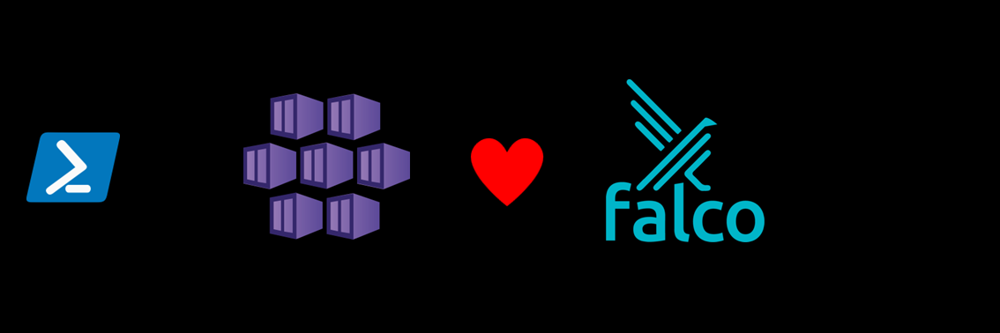

# AKS Cookbook

## 🧪 AI-Driven Security Threat Detection and Response in AKS

This lab is designed to assist engineers in setting up an AI-driven security threat detection and response system within an Azure Kubernetes Service (AKS) environment. This document includes CLI commands, code snippets, and configuration details to ensure smooth implementation and robust security monitoring.  
This lab based on this [public GitHub repo](https://github.com/gkaleta/AI-Driven-Security-Threat-Detection-and-Response-in-Kubernetes-on-Azure).

### Prerequisites

- [Python 3.8 or later version](https://www.python.org/) installed.
- [VS Code](https://code.visualstudio.com/) installed with the [Jupyter notebook extension](https://marketplace.visualstudio.com/items?itemName=ms-toolsai.jupyter) enabled.
- [Azure CLI](https://learn.microsoft.com/en-us/cli/azure/install-azure-cli) installed.
- [An Azure Subscription](https://azure.microsoft.com/en-us/free/) with Contributor permissions. If you don't have an Azure subscription, create an [Azure free account](https://azure.microsoft.com/en-us/pricing/purchase-options/azure-account?icid=azurefreeaccount) before you begin.
- [Sign in to Azure with Azure CLI](https://learn.microsoft.com/en-us/cli/azure/authenticate-azure-cli-interactively) and select the Azure Subscription that you want to use in this lab.
- [Install kubectl](https://learn.microsoft.com/en-us/cli/azure/aks?view=azure-cli-latest#az-aks-install-cli), the Kubernetes command-line tool.
- [Install helm](https://helm.sh/).

### 🚀 Get started

Proceed by opening the [Jupyter notebook](aks-falco.ipynb), and follow the steps provided.

### 🗑️ Clean up resources

When you're finished with the lab, you should remove all your deployed resources from Azure to avoid extra charges and keep your Azure subscription uncluttered.
Use the [clean-up-resources notebook](clean-up-resources.ipynb) for that.
