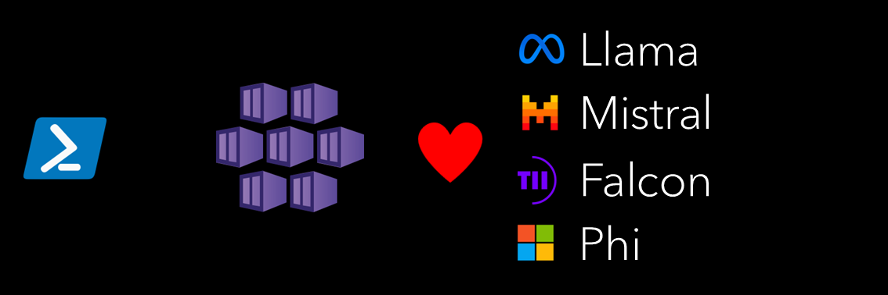

# AKS Cookbook

## 🧪 Kubernetes AI Toolchain Operator (KAITO) lab

Kaito is an operator that automates the AI/ML model inference or tuning workload in a Kubernetes cluster. The target models are popular open-sourced large models such as falcon and phi-3. 
In this lab we explore the workflow of onboarding large AI inference models in Kubernetes with Kaito.  
It's based on the official [AKS documentation](https://learn.microsoft.com/en-us/azure/aks/ai-toolchain-operator).  

### Prerequisites

- [Python 3.8 or later version](https://www.python.org/) installed.
- [VS Code](https://code.visualstudio.com/) installed with the [Jupyter notebook extension](https://marketplace.visualstudio.com/items?itemName=ms-toolsai.jupyter) enabled.
- [Azure CLI](https://learn.microsoft.com/en-us/cli/azure/install-azure-cli) installed.
- [An Azure Subscription](https://azure.microsoft.com/en-us/free/) with Contributor permissions. If you don't have an Azure subscription, create an [Azure free account](https://azure.microsoft.com/en-us/pricing/purchase-options/azure-account?icid=azurefreeaccount) before you begin.
- [Sign in to Azure with Azure CLI](https://learn.microsoft.com/en-us/cli/azure/authenticate-azure-cli-interactively) and select the Azure Subscription that you want to use in this lab.
- [Install kubectl](https://learn.microsoft.com/en-us/cli/azure/aks?view=azure-cli-latest#az-aks-install-cli), the Kubernetes command-line tool.
- [Install helm](https://helm.sh/).

### 🚀 Get started

Proceed by opening the [Jupyter notebook](aks-kaito.ipynb), and follow the steps provided.

### 🗑️ Clean up resources

When you're finished with the lab, you should remove all your deployed resources from Azure to avoid extra charges and keep your Azure subscription uncluttered.
Use the [clean-up-resources notebook](clean-up-resources.ipynb) for that.
