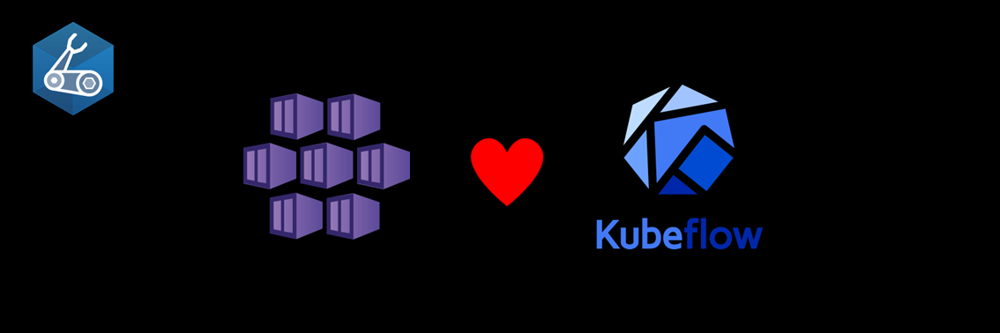

# AKS Cookbook

## 🧪 Kubeflow on AKS lab

The Kubeflow project is dedicated to making deployments of machine learning (ML) workflows on Kubernetes simple, portable and scalable.  
In this lab you will deploy an Azure Kubernetes Service (AKS) cluster and other Azure services (Container Registry, Managed Identity, Key Vault) with Azure CLI and Bicep. You will then install Kubeflow using the default settings using Kustomize and create a jupyter notebook server you can easily access on your browser
It's based on the Vanilla Installation [from this page](https://azure.github.io/kubeflow-aks/main/docs/deployment-options/vanilla-installation/).  

### Prerequisites

- [Python 3.8 or later version](https://www.python.org/) installed.
- [VS Code](https://code.visualstudio.com/) installed with the [Jupyter notebook extension](https://marketplace.visualstudio.com/items?itemName=ms-toolsai.jupyter) enabled.
- [Azure CLI](https://learn.microsoft.com/en-us/cli/azure/install-azure-cli) installed.
- [An Azure Subscription](https://azure.microsoft.com/en-us/free/) with Contributor permissions. If you don't have an Azure subscription, create an [Azure free account](https://azure.microsoft.com/en-us/pricing/purchase-options/azure-account?icid=azurefreeaccount) before you begin.
- [Sign in to Azure with Azure CLI](https://learn.microsoft.com/en-us/cli/azure/authenticate-azure-cli-interactively) and select the Azure Subscription that you want to use in this lab.
- [Install kubectl](https://learn.microsoft.com/en-us/cli/azure/aks?view=azure-cli-latest#az-aks-install-cli), the Kubernetes command-line tool.
- [Install Kustomize](https://kubectl.docs.kubernetes.io/installation/kustomize/)

### 🚀 Get started

Proceed by opening the [Jupyter notebook](aks-kubeflow.ipynb), and follow the steps provided.

### 🗑️ Clean up resources

When you're finished with the lab, you should remove all your deployed resources from Azure to avoid extra charges and keep your Azure subscription uncluttered.
Use the [clean-up-resources notebook](clean-up-resources.ipynb) for that.
